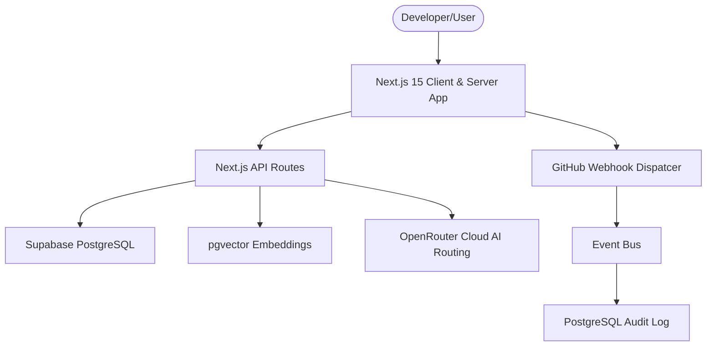

# Pulse Architecture Specification

Detailed documentation of Pulse's technical design, service-to-database interfaces, and routing design.

## Core System Architecture

---

## Technical Stack & Layout

### 1. Unified Client/Server App Router (Next.js 15)
* Pulse is built using the Next.js 15 App Router framework. Page layout routes are static or dynamically compiled server-side.
* Navigation states and active routes are managed via Next.js client hooks (`usePathname`).
* Sidebar structure provides access to dashboards, gantt roadmaps, event timelines, RAG search systems, and human approval queue interfaces.

### 2. Database & RAG Search Layer (Supabase PostgreSQL + pgvector)
* **RLS Security Policies**: Row-Level Security ensures that developers only read/write workspaces, tasks, and sprints they are members of.
* **Vector Semantic Indexing**: The `tasks` table includes a `vector(1536)` column for storing text embeddings, backed by a vector-cosine index.
* **Hybrid Search Procedure**: PostgreSQL `match_tasks` procedure computes nearest-neighbor task lists and merges them with standard keyword queries for re-ranking.

### 3. Cloud Reasoning Gateway (OpenRouter)
* All AI requests are routed through OpenRouter to specialized agent models:
  * Planner/Manager: Qwen3 32B
  * Architect/Developer: DeepSeek R1
  * QA/Critic: Llama 3.3 70B
  * Storyteller: Mistral Small
