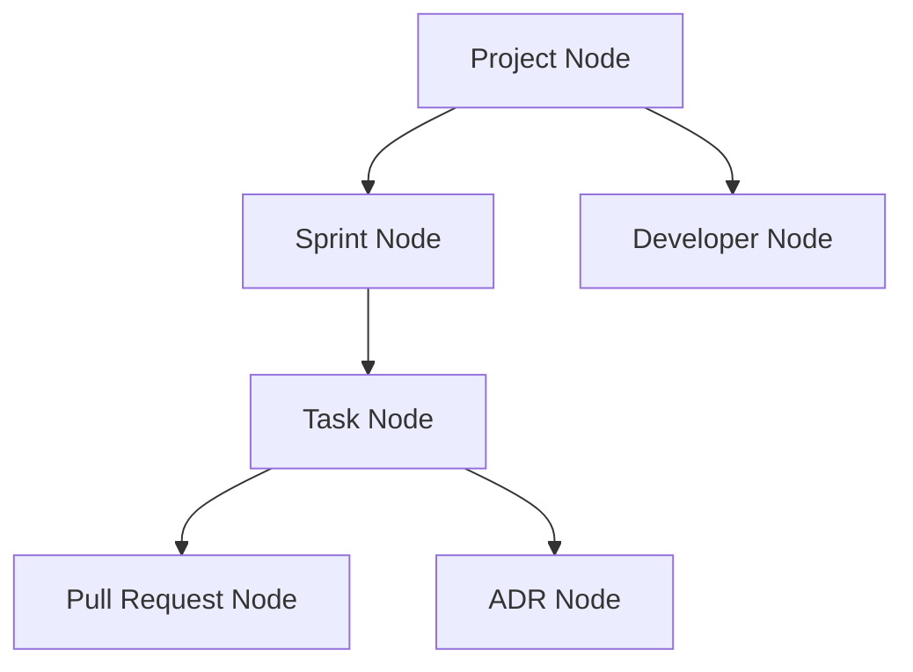

# Engineering Knowledge Graph

Detailed description of Pulse's relational data graph linking tasks, pull requests, decisions, and developers.

## Node Relationships

## Interactive UI Canvas

The visualization page `/dashboard/graph` maps coordinates for nodes dynamically:
* Nodes represent key workspace items (e.g. *Acme platform core*, *Sprint 14: Core API*, *ADR-004: Next.js Auth*).
* Edges represent system dependencies (e.g. *Depends On*, *Implements*, *Approved By*).
* Clicking nodes opens a side drawer detailing the object metadata and active relations.
