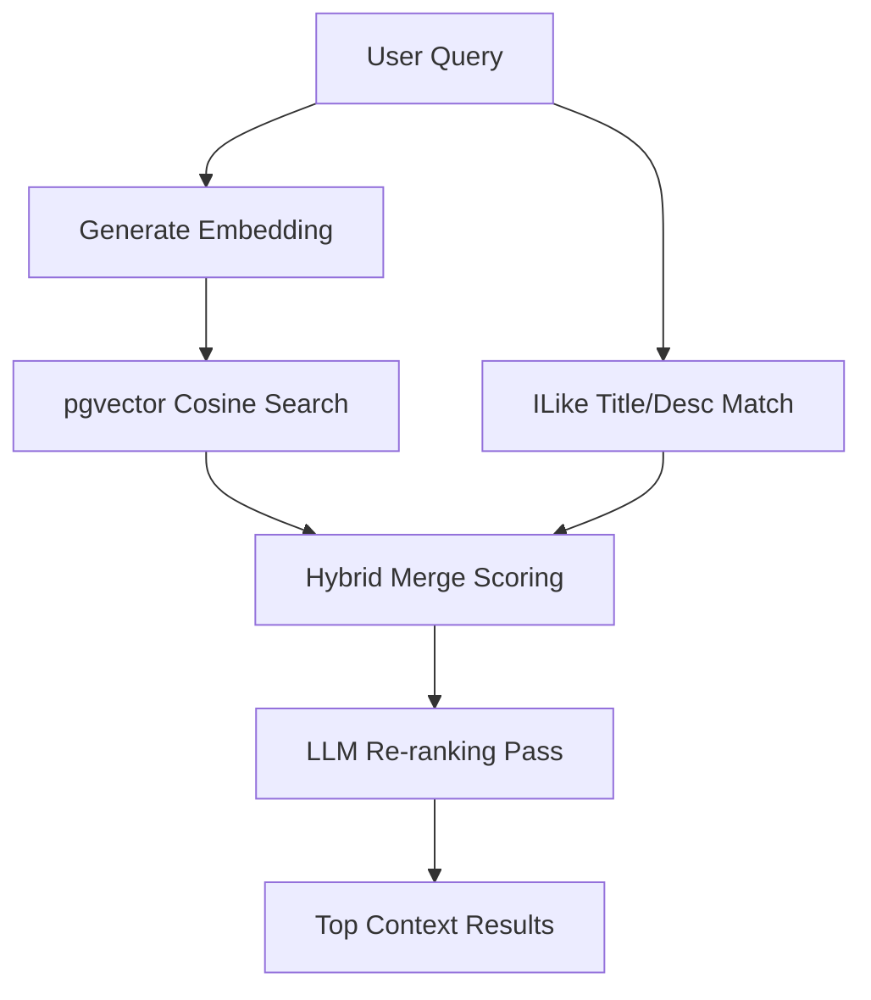

# Retrieval-Augmented Generation (RAG) Search

Detailed documentation of Gravity's hybrid RAG search flow.

## RAG Flow Chart

---

## Technical Flow Overview

### 1. Hybrid Merge Logic
Search items retrieved from text-similarity filters (Keyword) and nearest-neighbor vector matches (Vector) are combined and scored:
* A task returned by both searches receives a relevancy score boost to bubble up in the results.

### 2. LLM Re-ranking Pass
The merged results are sent to OpenRouter (`qwen-2.5-7b-instruct`) in a JSON format. The model evaluates matching relevance to the original prompt query and returns a re-ranked array of IDs to build context.
