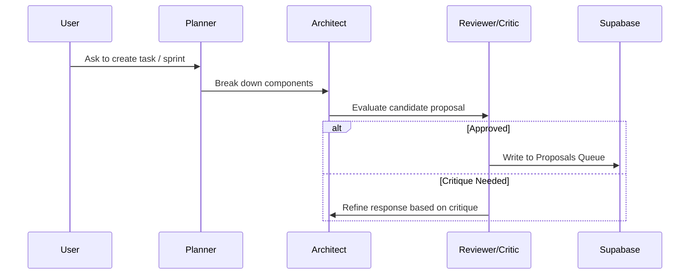

# Gravity Technical Highlights & AI-OS

This document specifies the multi-agent orchestration, self-reflection mechanisms, and security guardrail interceptors built into Gravity.

## 🤖 AI-OS Multi-Agent Runtime

---

## Technical Features Overview

### 1. Human Approval Guardrails
* **Intercept Queue**: High-impact tool executions (`create_sprint`, `create_task`, `generate_adr`) do not run automatically. The `toolRegistry.ts` intercepts these commands and adds a `Pending` proposal into the database.
* **Review Console**: Authorized engineers review proposals inside `/dashboard/guardrails`. Approving a proposal triggers database execution and publishes event notifications.

### 2. Engineering Memory query system
* ** RAG Synthesis**: Combines ADR decision logs and workspace audit logs.
* **Decoupled Reranking**: Merges keyword-matching tasks and vector-matching items, then queries OpenRouter to re-rank the context before producing explanations of database transitions.

### 3. Event Bus & Webhooks
* GitHub push webhook triggers publish event notifications onto the event bus, logging timeline events and generating Spotify-style Project Wrapped metrics on-the-fly.

### 4. Predictive ML Pipeline Status
* **Prototype Proof of Concept**: The XGBoost and LightGBM sprint delivery estimations and team burnout metrics are currently simulated via deterministic heuristic mock models on the server. They serve as interface prototypes demonstrating how frontend metrics bind to ML server APIs.

